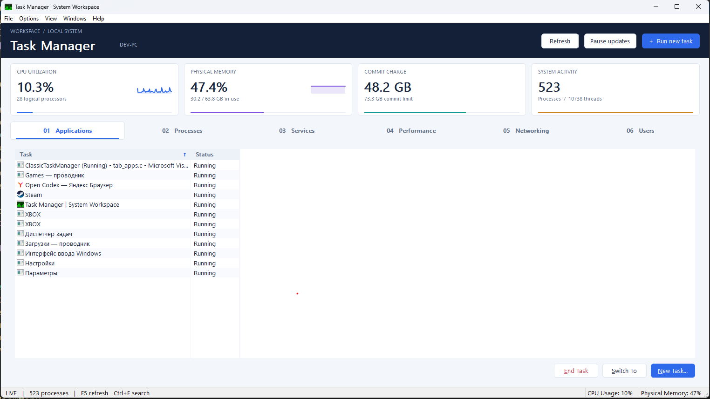
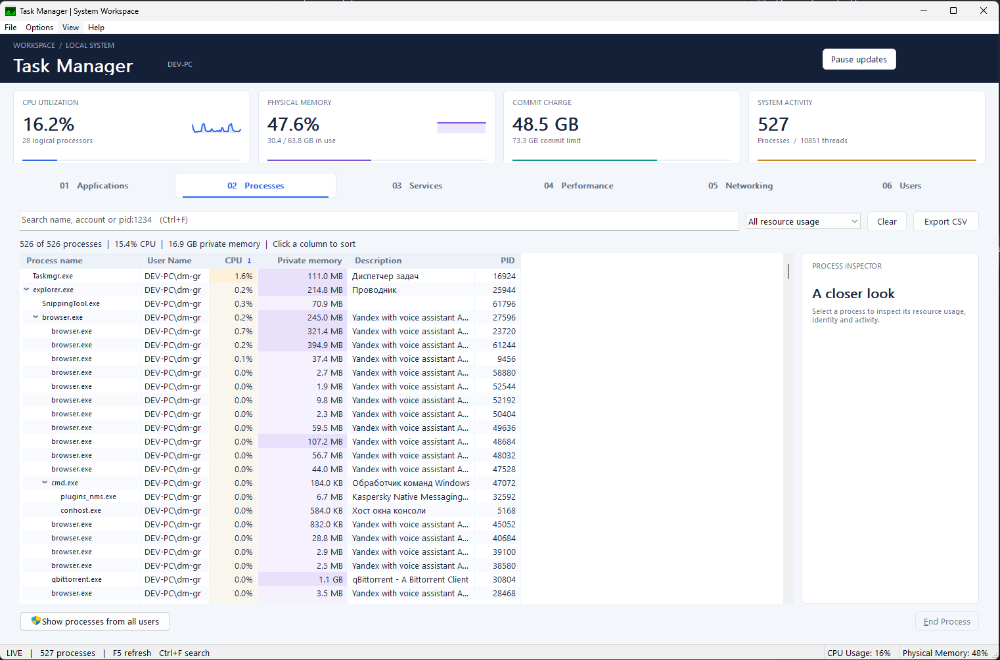

# Recharged Classic Task Manager — System Workspace

A charged native Win32 system task manager, built on the six-tab layout of the
classic Windows Task Manager. Version 2 adds a live resource dashboard,
process investigation tools, and a styled, DPI-aware workspace.

No MFC/ATL/WTL, no .NET, no Qt, no third-party libraries, no package
manager, no GUI designer. Everything is created in code or from
`resource.rc`. The result is a single executable with no runtime
dependencies beyond what ships with Windows.

## Workspace features

- Live CPU, physical memory, commit charge and process/thread summary cards,
  with CPU and memory sparklines. Refresh, pause/resume and Run New Task are
  available in the header on every tab.
- Processes: search across image name, description, account and PID. Space-separated
  terms must all match; `pid:1234` matches a PID exactly. Resource filters show
  processes using at least 1% CPU or 100 MB of private memory. Search and sorting
  still work while sampling is paused.
- The process inspector shows identity, account, CPU usage, private memory,
  parent PID, thread/handle counts, CPU time and lifetime I/O where available.
  It moves below the table in smaller windows. Open File Location checks process
  identity before revealing its executable in Explorer; Copy Details copies a
  text summary. Existing end-process safeguards and confirmation remain in place.
- Export CSV captures the current filtered, sorted process snapshot when clicked.
  Files use UTF-8 with a BOM, escaped text fields, numeric byte counts, and empty
  cells for unavailable memory. A completed temporary file replaces the destination
  only after writing succeeds. Text that could be interpreted as a spreadsheet
  formula is prefixed with an apostrophe.
- CPU/memory graphs use distinct colors; per-processor and kernel-time graph
  options remain available in View. Networking adds sortable receive/send rates
  in B/s, KB/s and larger units alongside utilization and link speed.
- Spike Blame: hover the CPU or memory history graph to see the five processes
  using the most CPU or private memory at that moment, with the time of the
  sample. Processes that have since exited are marked. Click a column to open
  its busiest still-running process in the Processes tab. Ctrl+B pins the
  highest CPU sample on screen. Culprits are recorded every sample on every
  tab, so a spike can be explained after the fact; pausing freezes them along
  with the graphs. The per-CPU graph grid and tiny footprint mode do not blame.
- Alternating table rows, CPU/memory cell shading, styled navigation, and
  scalable fonts and columns make large snapshots easier to scan. PID 0 (idle
  capacity) is excluded from the process table and its resource totals.

Window sizes are constrained to the current monitor's usable area, including
after DPI changes. Very short windows prioritize the process table or performance
graphs; process actions remain in the table's context menu. Tab/Shift+Tab traverses
both the header and page controls.

| Shortcut | Action |
| --- | --- |
| Ctrl+F | Open Processes and focus search |
| Ctrl+P | Pause/resume the previous sampling speed |
| Ctrl+B | Pin the CPU peak on the Performance tab and show its culprits |
| Ctrl+N | Run a new task |
| F5 | Refresh once, including while paused |
| Ctrl+Tab / Ctrl+Shift+Tab | Next/previous tab |

Pause prevents scheduled sampling; an in-flight collection may finish.
Refreshing or switching tabs while paused collects once. Rates are averages
over the interval between adapter samples; disconnects and counter resets
start a new baseline. Protected processes can expose fewer details.





---

## Build

This is a **Windows-only C11 CMake project**. Install CMake 3.25 or newer and
one of these compilers:

- Visual Studio 2022 or newer with the Desktop development with C++ workload
  and a Windows SDK.
- MinGW-w64 with `gcc` and `windres` on PATH.

The supplied presets and convenience scripts also require Ninja on PATH.
There are no downloaded libraries or package-manager dependencies.

### CMake directly

With MinGW-w64 on PATH:

```powershell
cmake --preset mingw-release
cmake --build --preset mingw-release --parallel
ctest --preset mingw-release
```

Use `mingw-debug`, `msvc-release`, or `msvc-debug` in all three commands for
another configuration. The MSVC Ninja presets require a developer environment;
use an x64 Native Tools prompt, or use `build.ps1` below to import it automatically.
Outputs are `build/<preset>/bin/<Release|Debug>/taskman.exe`; each compiler and
configuration has its own build directory. Ninja presets also generate
`compile_commands.json` for editors.

CMake also supports a Visual Studio solution without Ninja or a developer prompt:

```powershell
cmake -S . -B build/vs -G "Visual Studio 17 2022" -A x64
cmake --build build/vs --config Release --parallel
ctest --test-dir build/vs -C Release --output-on-failure
```

Select the generator for your installed Visual Studio version (for example,
`Visual Studio 18 2026`). Open the repository folder in a CMake-aware IDE, or
open the generated solution. Ordinary `cmake -S . -B build/cmake` also works
with CMake's default installed generator.

| CMake option | Effect |
| --- | --- |
| `-DTASKMAN_STRICT=ON` | Application warnings become errors (default OFF) |
| `-DBUILD_TESTING=OFF` | Build only the application (default ON) |
| `-DCMAKE_BUILD_TYPE=Debug` | Debug configuration for single-configuration generators |

Tests always compile with warnings as errors and with assertions enabled,
including in Release. Builds must use a separate binary directory.
To stage the executable locally: `cmake --install build/vs --config Release --prefix build/stage`.

### Convenience commands

`build.ps1` and `build.cmd` configure and build the same CMake targets.
The PowerShell driver uses `vswhere` to import MSVC's x64 environment when
needed, and falls back to MinGW-w64 when MSVC is absent. It copies the selected
application executable to `build/taskman.exe` for existing shortcuts.

```powershell
.\build.ps1
.\build.ps1 test -Toolchain mingw -Strict
.\build.ps1 test -Toolchain msvc -Configuration Debug -Strict
```

From cmd.exe use `build`, `build test`, or `build debug`.

| Target | Effect |
| --- | --- |
| *(none)* / `build` | Build the application (Release by default) |
| `rebuild` | Remove generated build directories, then build |
| `debug` | Build the application with symbols and optimization disabled |
| `test` | Build the application and run all ten CTest suites |
| `run` | Build, then launch the application |
| `clean` | Remove `build/` and legacy `tests/.build/` |

| Option | Effect |
| --- | --- |
| `-Toolchain msvc` / `mingw` / `auto` | Select the compiler (default auto) |
| `-Configuration Release` / `Debug` | Select configuration; `debug` target forces Debug |
| `-Strict` | Application warnings become errors |
| `-Verbose` | Show compiler command lines |

`mingw32-make`, `mingw32-make debug`, `mingw32-make test`,
`mingw32-make clean`, and `mingw32-make STRICT=1` remain available. The Makefile
forwards to the CMake driver with MinGW selected; it has no separate source or
link-library lists. `DEBUG=1` selects Debug for its other targets.

MSVC builds use `/W4`, a static CRT (`/MT`, or `/MTd` for Debug), a Unicode
Windows entry point, and release link-time optimization when supported.
The embedded manifest comes from `res/resource.rc`; linker manifest generation
is disabled for targets embedding that resource. MinGW uses `gnu11`, `-O2`
in Release, and a Unicode Windows subsystem executable. The application keeps
the original warning set, including conversion, shadowing and prototype checks.

### Tests (Windows, MSVC or MinGW-w64)

Use CTest as above, `build test`, or `powershell -NoProfile -File tests/run.ps1`.
The latter accepts the same `-Toolchain`, `-Configuration`, and `-Strict` options.
Most suites include the implementation under test with Win32 action/UI boundaries
stubbed; the live collector and workspace suites exercise real Windows APIs.
The workspace fixture needs a desktop session and runs serially within CTest.

- Registry strings: malformed byte counts, missing terminators, invalid types,
  exact fits, insufficient capacities, and extreme saved window rectangles.
- System tool launch boundaries and elevation handoff: real command handlers
  and startup logic, with shell/token/window API boundaries intercepted.
- Collector failures: event/thread creation errors, shutdown ordering,
  repeated starts and history wraparound.
- Live collector: real Windows counters and worker events, pause, refresh,
  stop and three restart cycles.
- Process collection, identity, search/filter combinations, selection restoration,
  CSV quoting/Unicode/unknown values/write errors, and application action boundaries.
- Network counters, rates, resets and history; service/session action boundaries.
- Real Win32 workspace controls: search, selection, disabled actions, pause/refresh,
  all six tabs, keyboard traversal, compact/short-wide layouts, tiny mode,
  monitor bounds, and 150%/200% font and column scaling.
  The UI fixture lives off-screen and writes captures under `<binary-dir>/tests/.build/`.

Tests do not launch system utilities, request UAC, alter privileges, or write
application registry settings. The startup test reads existing settings;
registry parsing tests use injected registry responses. Test executables and
local build artifacts remain in the selected CMake binary directory.

### Layout

```
include/        app.h  ui.h  ntapi.h  gdiplusapi.h  proc_tree.h  resource.h
src/            main.c  ui.c  settings.c  sysinfo.c
src/tabs/       tab_apps.c  tab_processes.c  tab_services.c
                tab_perf.c  tab_network.c  tab_users.c  proc_tree.c
res/            resource.rc  app.manifest  app.ico
tests/          ten suites + CMakeLists.txt + run.ps1
build/          generated CMake directories and convenience taskman.exe
CMakeLists.txt  application sources, resources, compiler settings and libraries
CMakePresets.json MSVC/MinGW Release/Debug presets
build.ps1       CMake front end with automatic compiler discovery
build.cmd       cmd.exe shim over build.ps1
Makefile        compatibility wrapper selecting MinGW-w64
```

| File | Contents |
| --- | --- |
| `src/main.c` | message loop, main window, menu bar, tab host, status bar, DPI/font handling, tiny footprint, tray CPU meter, New Task dialog, shared UI helpers |
| `src/ui.c` / `include/ui.h` | visual styles, live dashboard, chart drawing, navigation, button/table painting, column scaling |
| `src/sysinfo.c` | collector thread and all system data acquisition |
| `src/settings.c` | `HKCU\Software\ClassicTaskManager` persistence |
| `src/tabs/tab_*.c` | one translation unit per tab |
| `include/app.h` | shared declarations, the `TabPage` interface, the `Snapshot` struct |
| `include/ntapi.h` | hand-written native (undocumented) NT structures and prototypes |
| `include/gdiplusapi.h` | hand-written GDI+ flat-API declarations, for antialiased charts |
| `include/resource.h` | resource and command identifiers |
| `res/resource.rc` / `res/app.manifest` / `res/app.ico` | resources |

---

## Architecture

**Collector thread.** `sysinfo.c` runs one worker thread that samples the
machine on the update-speed interval (High 500 ms, Normal 1000 ms, Low
4000 ms, Paused blocks on the wake event). It fills the *back* buffer of a
two-entry `Snapshot` array, flips the front index under an `SRWLOCK`, and
posts `WM_APP_SNAPSHOT_READY` to the main window. The UI thread only ever
takes a shared lock and copies out what it needs, so no blocking
enumeration API is ever called on the message-pump thread. CPU and memory
history are pushed into a separate ring buffer on every tick regardless of
which tab is visible, so the Performance graphs stay continuous.

**Tab pages.** Each tab is a modeless child dialog created from the single
`IDD_TABPAGE` template with a shared workspace background, so
child-control backgrounds match the surface and `IsDialogMessage`
gives real Tab-key navigation inside the page. Every tab module exports one
`TabPage` struct of function pointers (`OnCreate`, `OnLayout`, `OnSnapshot`,
`OnCommand`, `OnNotify`, `BuildViewMenu`, `PrimaryControl`, ...); the host in
`main.c` knows nothing else about the tabs. Unimplemented hooks are `NULL`
and are simply skipped.

**Menu.** The menu bar is rebuilt in code whenever the active tab changes,
which is how `Windows` appears only on Applications and how the
tab-specific `View` items (`Select Columns...`, `CPU History`,
`Large/Small Icons`) come and go. Check marks and radio marks are refreshed
in `WM_INITMENUPOPUP`.

**DPI.** `GetDpiForWindow`, `GetDpiForSystem` and
`SystemParametersInfoForDpi` are resolved with `GetProcAddress` so the same
binary runs on Windows 10 and 11 without a load-time dependency on a newer
export; on failure it falls back to `SystemParametersInfo` plus a `MulDiv`
scale. The UI uses the system message-font family at 13 logical pixels,
with a larger type hierarchy for the dashboard and inspector. All
control geometry comes from dialog units via `MapDialogRect`, or from the
`DPX()` macro, so 125/150/200 % scaling lays out correctly.
`WM_DPICHANGED` recreates the font, re-applies it to every page and
relays out. List columns scale with DPI while retaining resized or hidden columns.

**Tiny footprint mode.** Double-clicking the empty area of the tab control
(or the margin around it) collapses the window to just the current page's
primary content: the menu bar, tab strip and status bar are hidden and the
page is told to lay itself out in "tiny" mode. The normal and tiny window
rectangles are remembered separately and both persist.

**Antialiasing.** GDI cannot antialias lines or polygons, so the chart
strokes and the filled area beneath them are drawn through GDI+ instead:
`UI_Chart`, `UI_ChartLine` and `UI_Polyline` in `ui.c` open one antialiased
surface per paint and stroke the whole trace in a single pass. `gdiplus.dll` is
resolved lazily with `GetProcAddress` against hand-written flat-API
declarations, so there is still no load-time dependency; if any export is
missing every entry point reports "no canvas" and the callers fall back to the
original `Polygon`/`Polyline` path. Grid lines stay on plain GDI, because they
are axis-aligned and one pixel wide and antialiasing would only blur them.
`UI_Card` takes the same route: GDI+ has no rounded-rectangle
primitive, so the outline is built as a path of four quarter-circle arcs,
inset half a pixel so the one pixel stroke lands on a pixel centre instead
of straddling two. Fill and outline are created before either is drawn, so
a failure part way through falls back to `RoundRect` rather than leaving a
half-drawn card. `GdiplusShutdown` runs once from `WM_DESTROY`.

**Tray CPU meter.** When `Options > Hide When Minimized` is on, minimizing
hides the window and shows a notification-area icon that is redrawn every
tick: a 16x16 32-bpp top-down DIB section with green bars over black, built
from the last 16 CPU samples and turned into an `HICON` with
`CreateIconIndirect`. The `TaskbarCreated` message is handled so the icon
comes back if Explorer restarts.

**Single instance.** A named mutex (`Local\ClassicTaskManagerSingleInstance`);
a second launch finds the existing window, restores and activates it, and
exits.

---

## Elevation

The executable ships an `asInvoker` manifest and never asks for elevation
on startup. `SE_DEBUG_NAME` is requested at startup and failure is ignored —
without it, non-elevated Task Manager still works, it just cannot open
some processes.

- **Show processes from all users** (Processes tab) carries a UAC shield via
  `BCM_SETSHIELD` and relaunches the app elevated with `ShellExecuteEx` +
  `runas` — the same thing the real Task Manager does, because seeing other
  sessions' processes genuinely requires the elevated token.
- **Create this task with administrative privileges** in the New Task dialog
  runs the target with the `runas` verb.
- Disconnect / Logoff / Send Message on the Users tab and Start / Stop on
  the Services tab will need elevation for anything outside the current
  session; they are specified to degrade with a clear message rather than
  fail silently.

Everything else — the process list, the graphs, the adapter list — works
unelevated with reduced detail for processes the caller cannot open
(`System`, `Registry`, `Secure System`, `Memory Compression`, protected
processes).

---

## Where the native API is used, and why

All of it lives behind `ntapi.h`, is declared by hand (nothing is taken
from `<winternl.h>`), and is reached through `GetProcAddress` on
`ntdll.dll`, so a missing or changed export degrades to a documented
fallback instead of failing to load.

| Call | Why the documented API is not enough |
| --- | --- |
| `NtQuerySystemInformation(SystemProcessInformation)` | One call returns image name, PID, parent PID, session, thread and handle counts, base priority, all I/O counters, kernel+user times **and** `WorkingSetPrivateSize` for every process. The documented route needs `CreateToolhelp32Snapshot` plus `OpenProcess` + `GetProcessMemoryInfo` + `GetProcessTimes` + `GetProcessIoCounters` per process, which is far slower and fails outright on processes that cannot be opened. `WorkingSetPrivateSize` — the "Memory (Private Working Set)" column — has no documented equivalent at all. |
| `NtQuerySystemInformation(SystemProcessorPerformanceInformation)` | Per-logical-processor idle/kernel/user times, needed for `View > CPU History > One Graph Per CPU`. `GetSystemTimes` only returns machine-wide totals. |
| `NtQuerySystemInformation(SystemPerformanceInformation)` | Paged/non-paged pool and cache page counts behind the *Kernel Memory* and *Cached* figures at the granularity the classic UI shows. |

Fallbacks currently in place: overall CPU comes from the documented
`GetSystemTimes`, and process/thread/handle counts, commit charge, pool
sizes and the system cache size come from `GetPerformanceInfo`. The
`SYSTEM_PROCESS_INFORMATION` path is wired up in milestone 2 with
`CreateToolhelp32Snapshot` as its documented fallback.

One approximation is worth naming: *Free* in the **Physical Memory (MB)**
group is computed as `Available - Cached`, because `GlobalMemoryStatusEx`
reports free + zero + standby as one number. Milestone 4 replaces this with
the exact zero/free page count from `SystemPerformanceInformation`.

---

## Persistence

Everything lives under `HKCU\Software\ClassicTaskManager`: window rect
(normal and tiny separately), maximized state, tiny-footprint state, active
tab, update speed, the four `Options` toggles, Applications view mode,
CPU-history mode, Show Kernel Times, network history mode, and the New Task
MRU list. Per-tab column set/order/widths and sort state join them as each
tab gains its data model.
