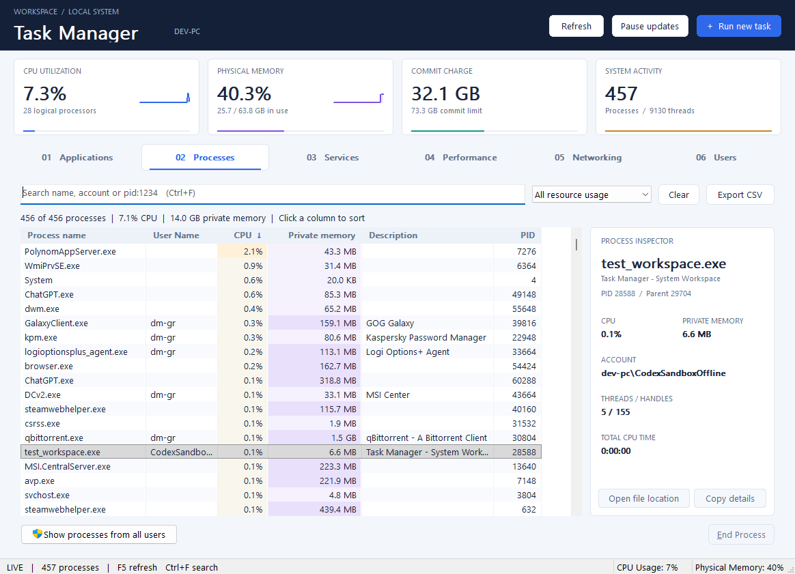

# System Workspace upgrade — 6 September 2026

Version 2 expands the existing native Win32 task manager. The six original tabs,
collector thread, registry settings, elevation handoff and protected-process
checks remain integrated with the new interface.

The workspace adds four live summary cards, styled navigation and tables,
CPU/memory sparklines and resource cell shading. Processes gains multi-term
search, exact PID lookup, CPU/memory filters, a responsive inspector, file-location
and clipboard actions, and UTF-8 CSV export of the current filtered snapshot.
Networking now includes sortable receive/send rates. Header controls and keyboard
shortcuts expose refresh, pause/resume and New Task on every tab.

Review found and resolved short-window inspector overlap, header keyboard
traversal, and window sizing beyond scaled monitor work areas. A regression test
also caught and fixed a collector timeout starting another scheduled sample after
Pause. The final full run of `tests/run.ps1` passed all nine suites, with warnings
treated as errors. The native workspace fixture exercises real controls, including
selection, search, pause/refresh, all tabs, keyboard traversal, short/wide windows,
tiny mode, monitor bounds, and 150%/200% font and column scaling. Tests do not launch
system utilities or perform actions on real processes or user sessions.

Both MinGW and MSVC builds succeed. The root `taskman.exe` is the MSVC release
build, with embedded version 2.0.0.0. The preview below is a render capture of the
real Win32 UI fixture. Local baseline source copies and captures are retained in
`tests/.build/`; this workspace is not a Git checkout.

